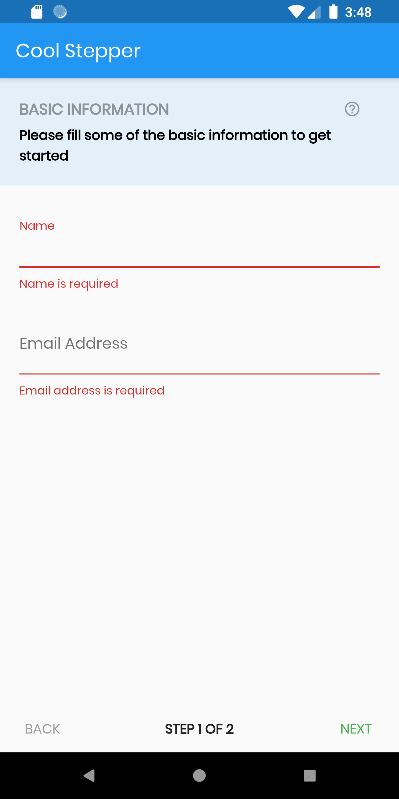
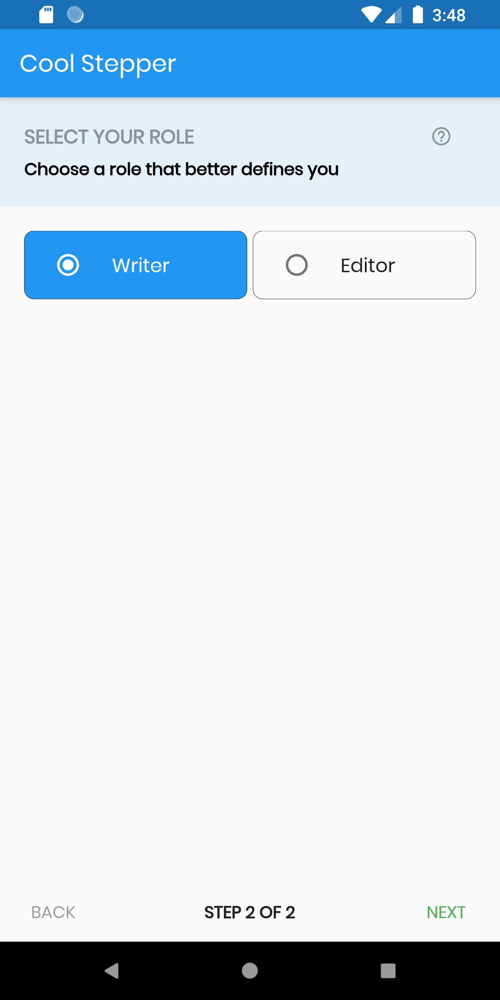

# cool_stepper

CoolStepper is a widget that displays a step by step sequence of operations. it could be helpful for a form wizard or onboarding.

## Usage

To use this package, add cool_stepper as a dependency in your pubspec.yaml file.
And add this import to your file.

import 'package:cool_stepper/cool_stepper.dart';

## Image
{ :width=250px } { :width=250px }

### Example

```
CoolStepper(
   onCompleted: () {},
   steps: List<CoolStep>[
       CoolStep(
        title: "Basic Information",
        subtitle: "Please fill some of the basic information to get started",
       ),
   ],
);
```


### CoolAlert Class

| Attribute        | Data type           | Description                                                                                                                                                   |            Default Value            |
|:----------------------|:-------------------|:--------------------------------------------------------------------------------------------------------------------------------------------------------------|:-----------------------------------:|
 onCompleted| Void Function()| @required - A function that is triggers when all steps have been completed | Null
steps| List<CoolStep>| @required |   Null              |


